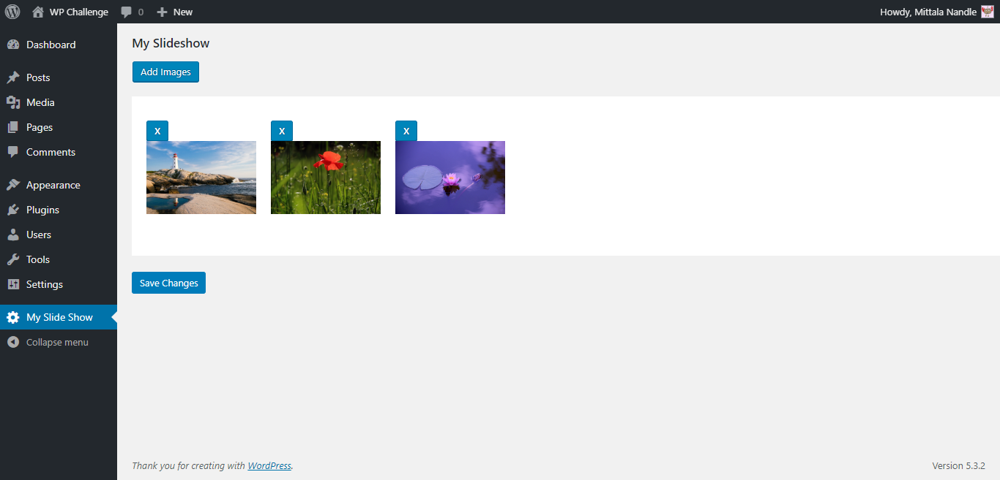
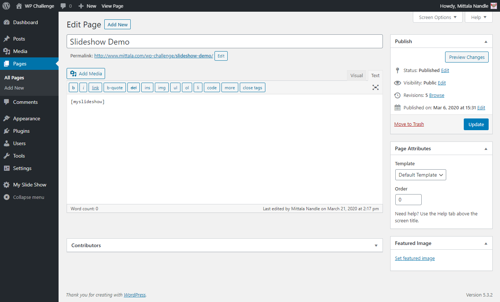
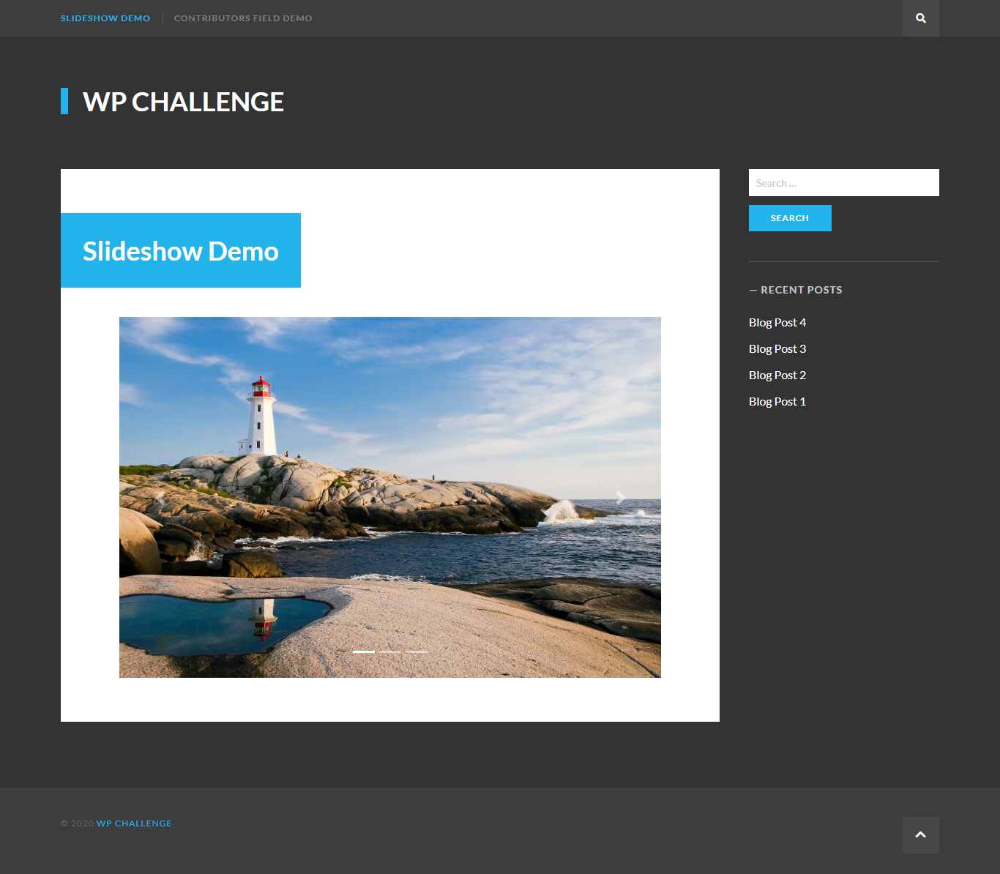

# My Slide Show Plugin
  This repository contains rtCamp Wordpress Engineer Challenge-2a: WordPress Slideshow 

## Features provided by this plugin :
* Add/remove images from plugin settings page
* Change order of images from plugin settings page
* Shortcode to display slideshow on pages/posts 

## List of Important 3rd party files :
>1. 'jquery.js' (Path: /lib/public/js/jquery.js)
>2. 'bootstrap.css' (Path: /lib/public/js/bootstrap.css)

## Installation and Usage :
>1. Upload 'my-slide-show' directory to '/wp-content/plugins/' 
>2. Activate 'My Slideshow' from Plugins page
>3. Visit 'My Slide Show > ' to add/remove images from slideshow 
>4. Use shortcode [myslideshow] on any page/post to display slideshow

##  Link of working plugin demo :

###  **https://www.mittala.com/wp-challenge/slideshow-demo/**

## Login Details :
> Username: test-user-01
> Password : test-user-01
  
## Screenshots :
#### Plugin settings page :

#### Use of Shortcode: [myslideshow] :

#### Slideshow frontend demo :

